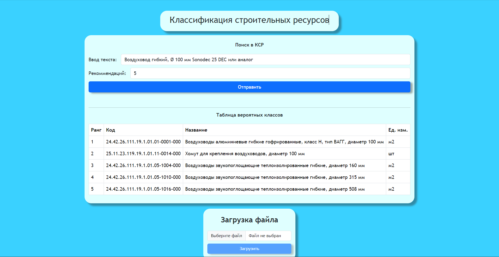

# Приведение номенклатуры участников рынка к официальному Классификатору Строительных Ресурсов

## Описание

В современной строительной индустрии актуальной задачей является стандартизация и унификация номенклатуры строительных материалов и ресурсов. Это обусловлено необходимостью повышения эффективности закупочной деятельности и логистики, а также упрощения взаимодействия между различными участниками строительного процесса. Важным инструментом в этом аспекте является Классификатор Строительных Ресурсов (КСР), который представляет собой официально утвержденную систему кодирования и категоризации строительных материалов.

Однако, на практике многие поставщики используют собственные номенклатуры и наименования, которые не всегда корректно сопоставимы с позициями КСР. Это приводит к сложностям при сопоставлении и верификации данных, увеличивает риски ошибок при закупках и может вести к закупке не соответствующих требованиям материалов.

Необходимо разработать модель ИИ, автоматически распознающую и сопоставляющую произвольные наименования строительных ресурсов с позициями в КСР, что позволит автоматизировать и значительно ускорить процесс верификации и закупок, минимизируя человеческий фактор и ошибки, связанные с ручной обработкой данных.

## Предлагаемое решение

Наше решение представляет собой ML с применением метода TF-IDF. TF (Частота термина) обозначает, насколько часто определенное слово появляется в данном документе. IDF (Обратная частота документа) измеряет, насколько уникально слово является по всей коллекции документов.

Классификация строительных ресурсов (КСР) взята за основу для определения классов. На основе этого ML модель может определять более 111 тыс. классов.

Она не требует трудоемкого обучения и способна быстро классифицировать данные с выделением нескольких восможных вариантов.

## Реализация приложения

Приложение состоит из двух частей:
1. API или серверная часть
2. WEB часть

API принимает текст или файл csv с набором данных. Для текста он возвращает JSON с наиболее подходящими полями. А для файла он возвращает таблицу формата

| Код | Плохое название | КСР |

WEB интерфейс

---

*Команда Prima*